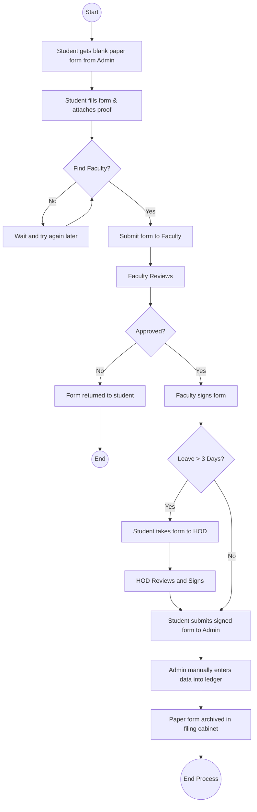
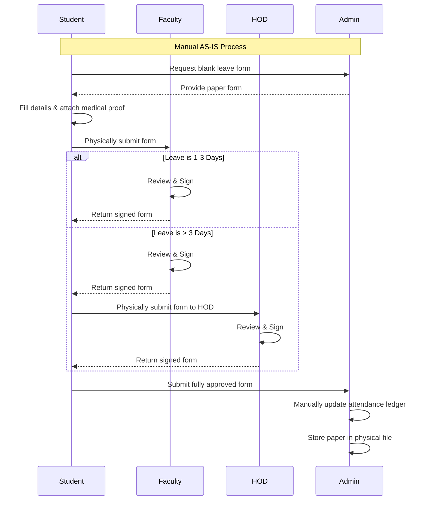

# Current Process (AS-IS)

## 1. Process Explanation
The existing leave management process is entirely physical and involves multiple manual hand-offs. 
1. The student collects a blank form from the admin office.
2. The student fills it out and attaches physical proof (if needed).
3. The student tracks down their Class Faculty for a signature. 
4. If the leave is greater than 3 days, they must then track down the HOD.
5. Once signed, the student submits the physical paper back to the Admin office.
6. The Admin manually enters the data into the attendance ledger.

This process takes an average of 3 to 5 days, creates frustration, and often results in lost paperwork.

## 2. BPMN Diagram (Mermaid)
*Note: Using Mermaid Flowchart to represent the BPMN structure.*

## 3. Swimlane Diagram (Mermaid)

