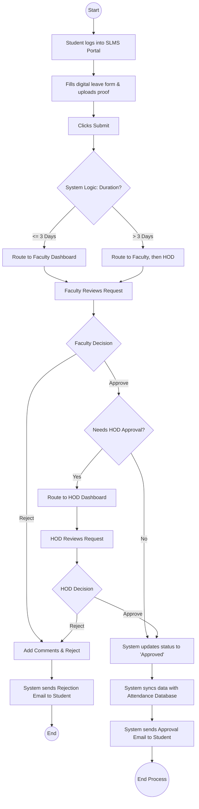
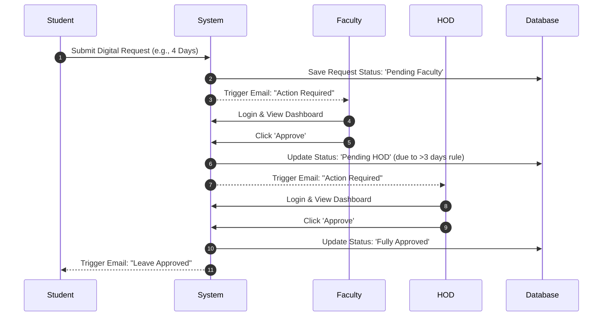

# Future Process (TO-BE)

## 1. Digital Workflow Explanation
The proposed TO-BE process eliminates paper entirely. 
1. The student logs into the SLMS portal and fills out a digital form.
2. The system automatically calculates routing based on business rules.
3. The Faculty receives an email notification, logs in, reviews the student's digital history, and clicks 'Approve'.
4. If the leave is >3 days, the system automatically forwards it to the HOD's digital queue.
5. Once fully approved, the system updates the database, notifying both the Admin and the Student simultaneously. 

This process reduces turnaround time to under 24 hours and provides 100% transparency.

## 2. Workflow Diagram (Mermaid)

## 3. Notification & Approval Flow (Sequence Diagram)

