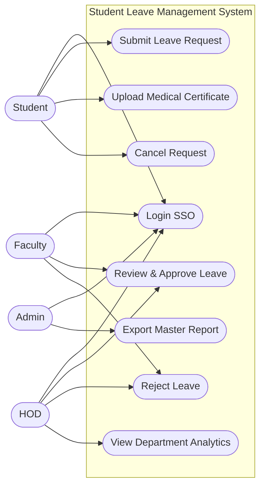

# Use Cases

## 1. Use Case Diagram (Mermaid)

## 2. Detailed Use Case Description

### Use Case 02: Submit Leave Request

| Attribute | Description |
| :--- | :--- |
| **Use Case ID** | UC-02 |
| **Use Case Name** | Submit Leave Request |
| **Primary Actor** | Student |
| **Preconditions** | 1. The Student is logged into the SLMS. 2. The Student has an active enrollment status in the SIS. |
| **Postconditions** | 1. A leave request is saved in the database with status 'Pending Faculty'. 2. An email is sent to the assigned Faculty. |
| **Main Success Flow** | 1. Student navigates to "New Leave Application". 2. Student selects 'Start Date' and 'End Date'. 3. System calculates total days (excluding weekends). 4. Student selects 'Leave Type' (e.g., Personal). 5. Student enters a 'Reason'. 6. Student clicks 'Submit'. 7. System validates inputs. 8. System saves the record and displays a success message. |
| **Alternative Flow (A1: Medical Leave)** | 4a. Student selects 'Leave Type' = 'Medical'. 4b. System makes the 'Upload Attachment' field mandatory. 4c. Student uploads a PDF certificate. 4d. Return to step 5. |
| **Exception Flow (E1: Invalid Dates)** | 7a. System detects 'End Date' is before 'Start Date'. 7b. System blocks submission and shows error: "End date must be after start date". 7c. Student corrects the dates. 7d. Return to step 6. |

### Use Case 05: Review & Approve Leave

| Attribute | Description |
| :--- | :--- |
| **Use Case ID** | UC-05 |
| **Use Case Name** | Review & Approve Leave |
| **Primary Actor** | Faculty (or HOD) |
| **Preconditions** | 1. The Approver is logged in. 2. There is at least one 'Pending' request in their queue. |
| **Postconditions** | 1. The request status is updated. 2. If <= 3 days, it is 'Fully Approved'. If > 3 days, it is 'Pending HOD'. |
| **Main Success Flow** | 1. Faculty navigates to Dashboard. 2. Faculty clicks on a pending request row. 3. System displays modal with student details, dates, reason, and past leave history. 4. Faculty clicks 'Approve'. 5. System checks duration. 6. System determines duration is <= 3 days. 7. System marks as 'Approved' and emails Student. |
| **Alternative Flow (A1: Route to HOD)** | 6a. System determines duration is > 3 days. 6b. System marks as 'Pending HOD'. 6c. System emails HOD for secondary approval. |
| **Alternative Flow (A2: Reject)** | 4a. Faculty clicks 'Reject'. 4b. System prompts for mandatory rejection reason. 4c. Faculty types reason and submits. 4d. System marks as 'Rejected' and emails Student. |
