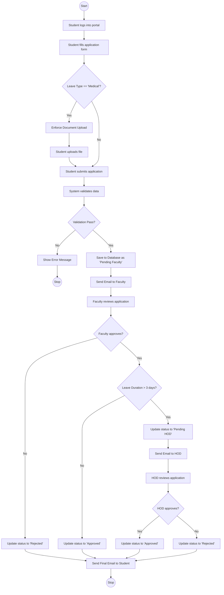
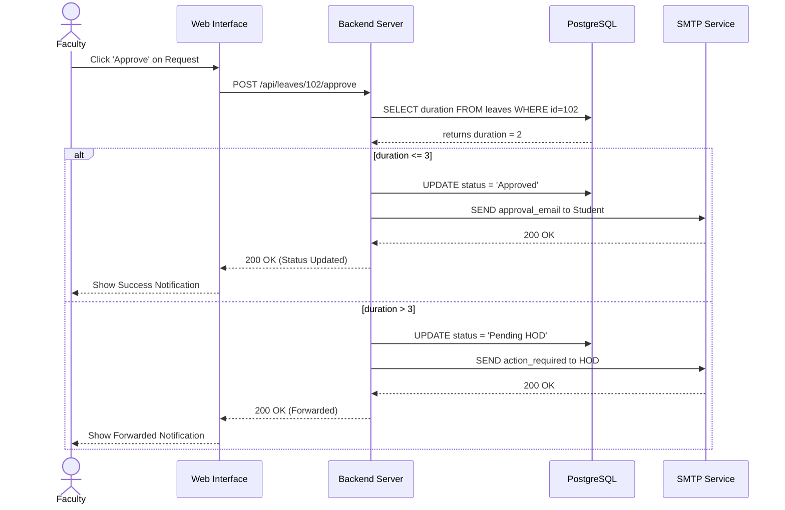
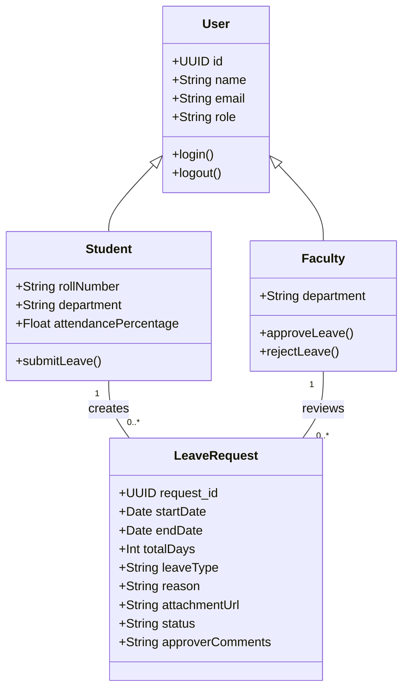
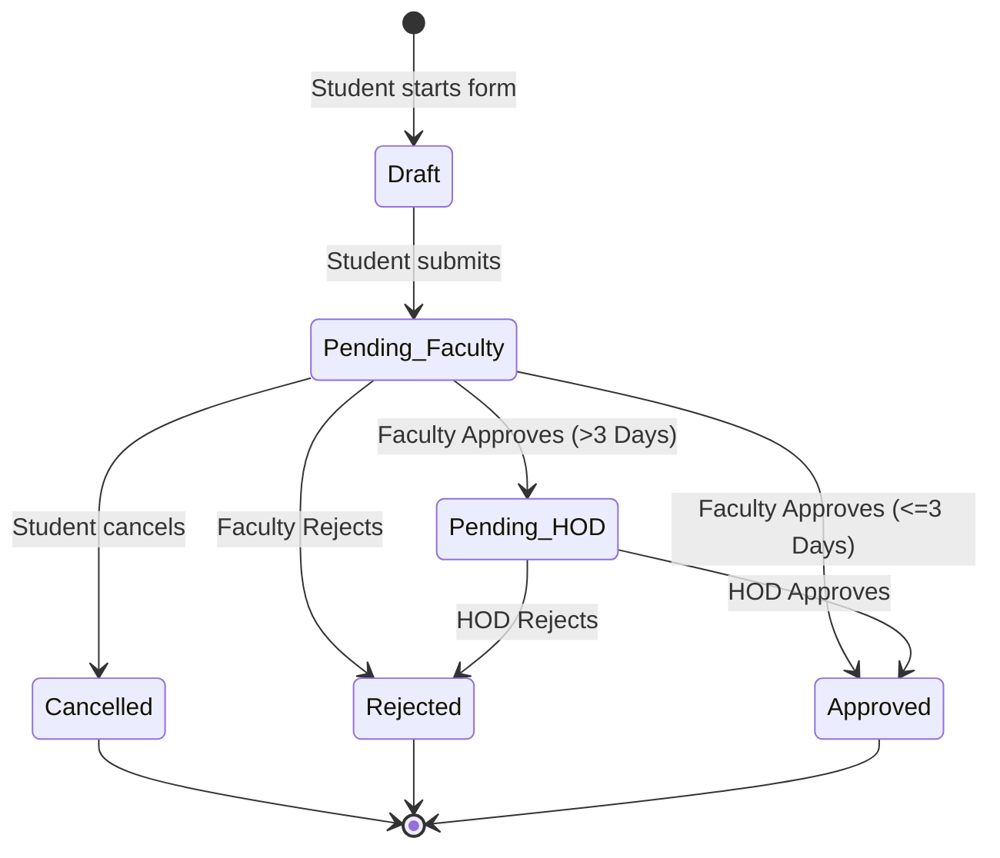

# UML Diagrams

## 1. Use Case Diagram
*(Refer to document 13_Use_Cases.md for the comprehensive Use Case diagram).*

## 2. Activity Diagram
This diagram shows the dynamic flow of activities when a student applies for leave.

## 3. Sequence Diagram
This diagram shows the object interactions for the Faculty approval process.

## 4. Class Diagram
This represents the static structural data model of the system.

## 5. State Machine Diagram
This diagram outlines the lifecycle states of a single `LeaveRequest` object.

