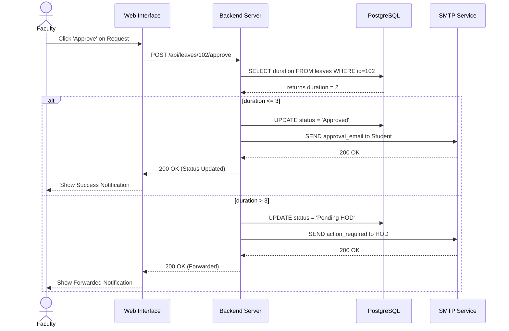
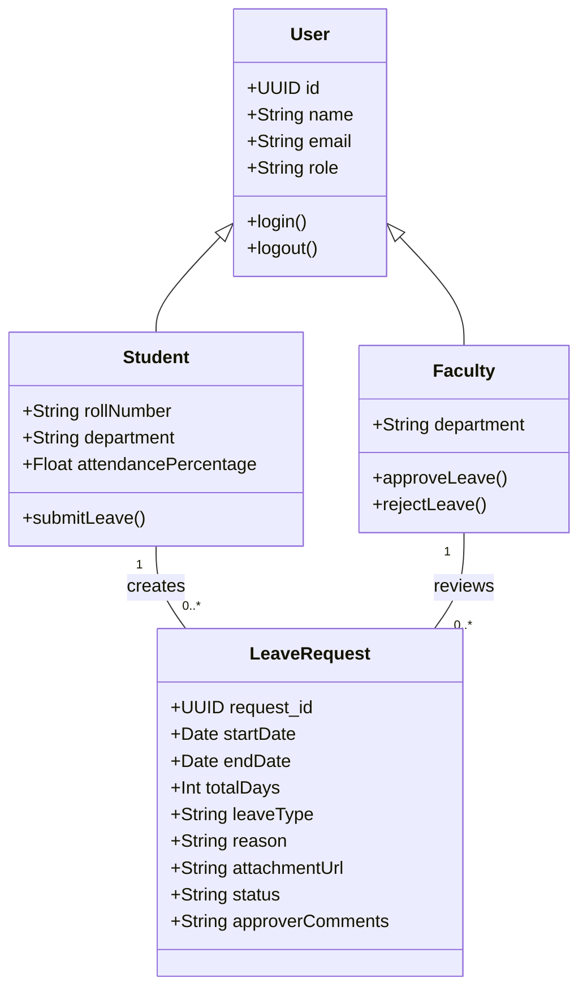
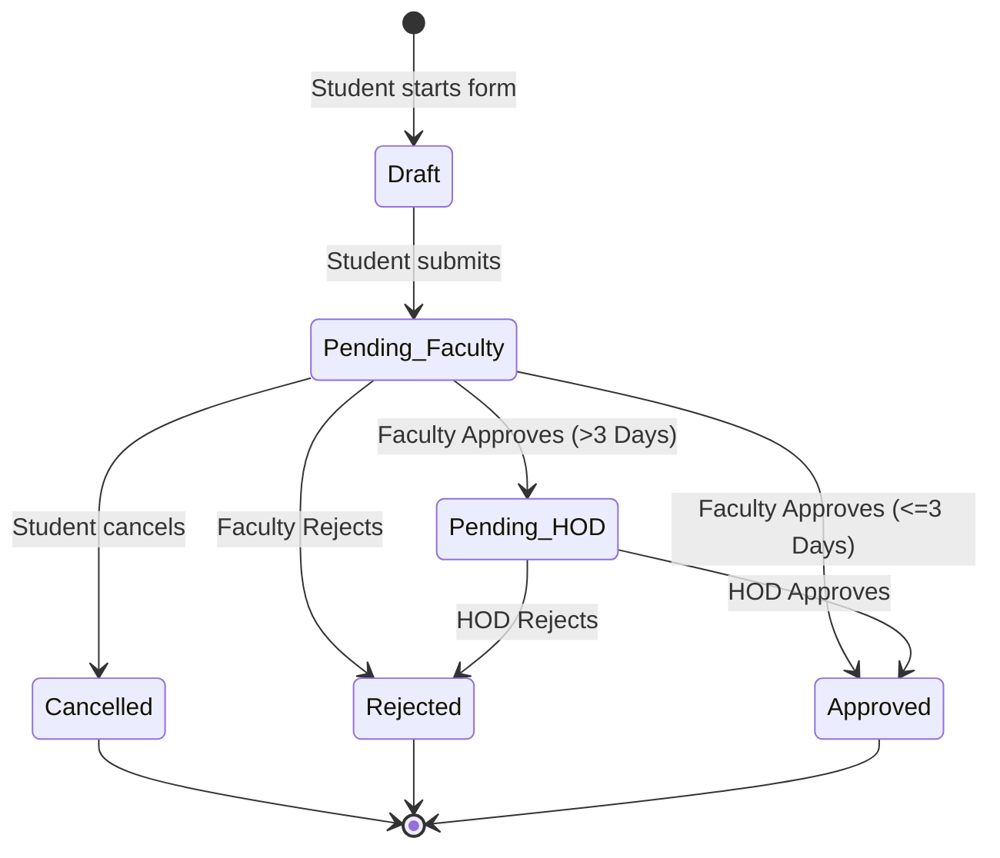

# UML Diagrams

## 1. Use Case Diagram
*(Refer to document 13_Use_Cases.md for the comprehensive Use Case diagram).*

## 2. Activity Diagram
This diagram shows the dynamic flow of activities when a student applies for leave.

```mermaid
activityDiagram
    start
    :Student logs into portal;
    :Student fills application form;
    if (Leave Type == 'Medical'?) then (Yes)
        :Enforce Document Upload;
        :Student uploads file;
    else (No)
    endif
    :Student submits application;
    :System validates data;
    if (Validation Pass?) then (Yes)
        :Save to Database as 'Pending Faculty';
        :Send Email to Faculty;
    else (No)
        :Show Error Message;
        stop
    endif
    
    :Faculty reviews application;
    if (Faculty approves?) then (Yes)
        if (Leave Duration > 3 days?) then (Yes)
            :Update status to 'Pending HOD';
            :Send Email to HOD;
            :HOD reviews application;
            if (HOD approves?) then (Yes)
                :Update status to 'Approved';
            else (No)
                :Update status to 'Rejected';
            endif
        else (No)
            :Update status to 'Approved';
        endif
    else (No)
        :Update status to 'Rejected';
    endif
    
    :Send Final Email to Student;
    stop
```

## 3. Sequence Diagram
This diagram shows the object interactions for the Faculty approval process.



## 4. Class Diagram
This represents the static structural data model of the system.



## 5. State Machine Diagram
This diagram outlines the lifecycle states of a single `LeaveRequest` object.


